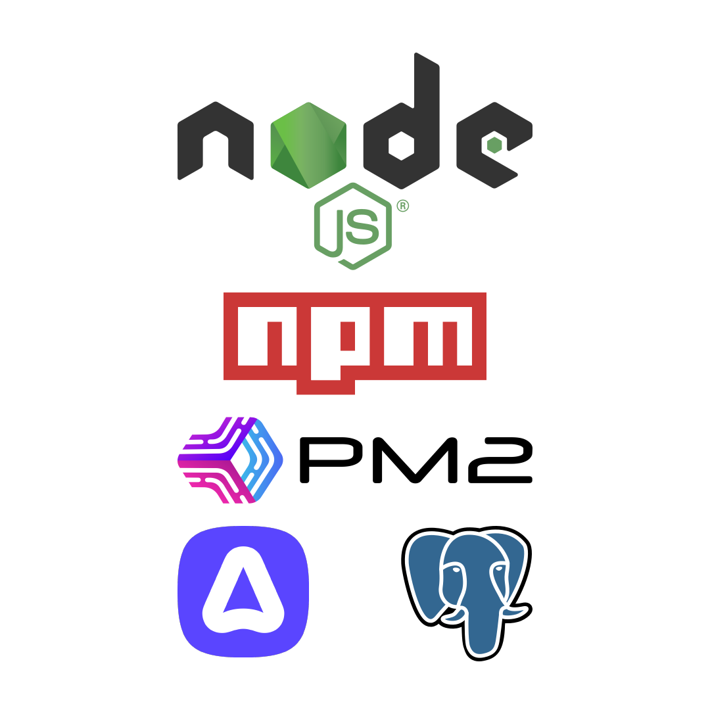
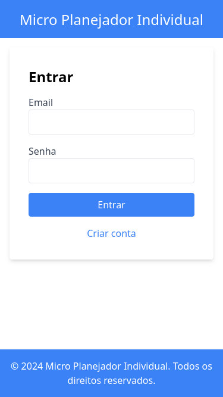
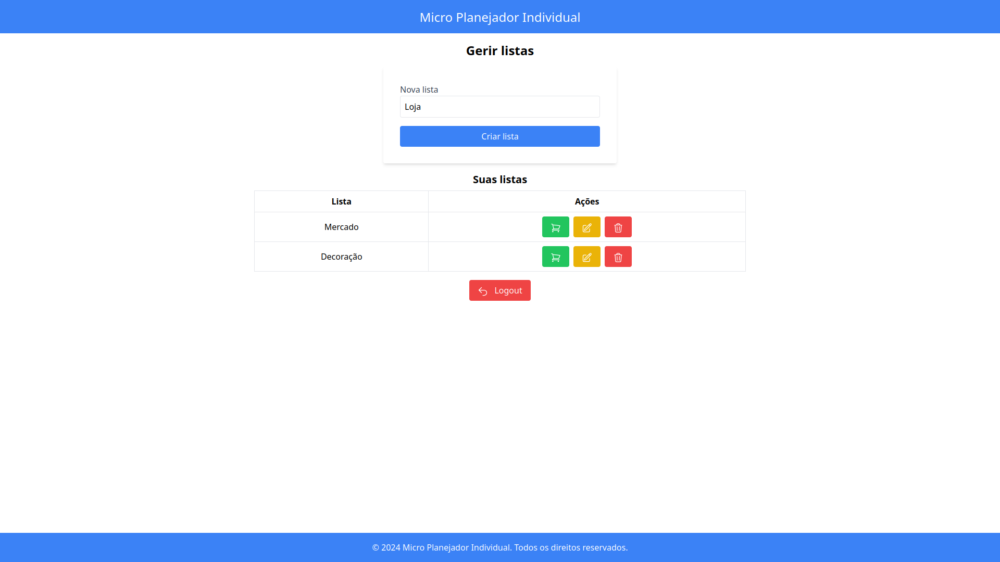
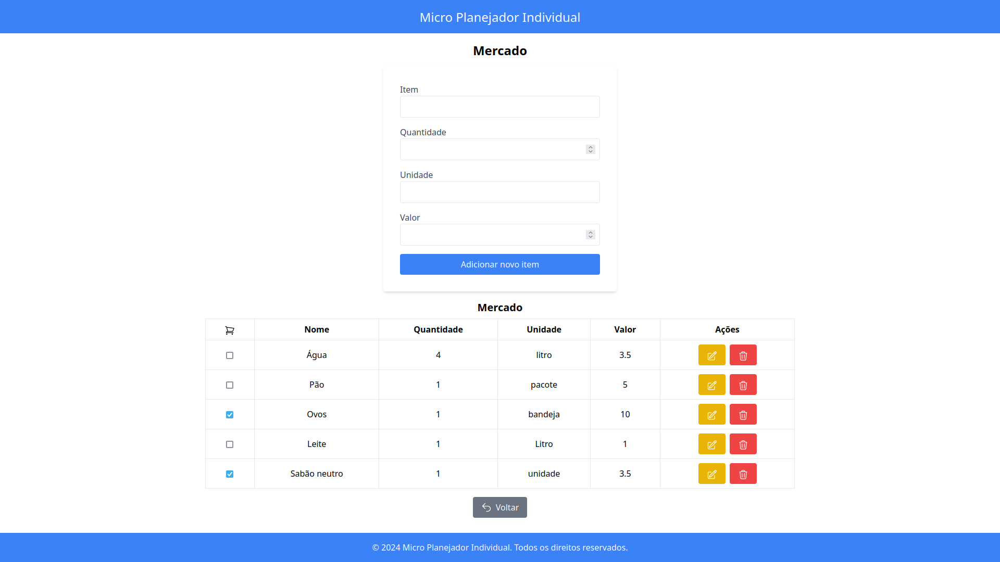

# **MPI**

Micro Planejador Individual

https://github.com/Azenha/Micro-Planejador-Individual

**Leonardo Azenha**

Projeto de Sistemas para Internet

---

# Contexto

* Listas de compras
    * Apenas apps mobile
    * Complexidade
    * Elementos indesejados

---

# Objetivos

* Simplicidade & Objetividade
* Centralização & Organização

---

# Tecnologias

* Backend
    * Node.js
    * npm
    * pm2
    * AdonisJS
    * PostgreSQL

---

# Tecnologias

* Frontend
    * Vue.js
    * Vite
    * Tailwind CSS
    * Heroicons

---

# Solução

Login

---

# Solução

Criação de usuário

---

# Solução

Gestão de listas

---

# Solução

Gestão de itens

---

# Demonstração

---

# Conclusões

* Aplicação de conhecimentos e habilidades
* Solução prática para um caso real
* Tecnologias modernas

---

# Retrospectiva

1. **Escopo Inicial**: O projeto pode ter um escopo inicial limitado em termos de funcionalidades oferecidas aos usuários. Isso pode impactar a adoção inicial e a satisfação do usuário.
2. **Complexidade de Implementação**: A abordagem code-first requer um planejamento e uma compreensão das interações entre o código e o banco de dados. Isso aumenta a complexidade da implementação.
3. **Requisitos de Manutenção**: Manter a consistência entre as atualizações de código e as alterações no esquema do banco de dados pode exigir um processo de gestão de mudanças rigoroso.

---

# Perspectivas

1. **Expansão de Funcionalidades**: Histórico de compras, listas compartilhadas, pode enriquecer a experiência do usuário e aumentar a utilidade da aplicação.
2. **Otimização de Desempenho**: A otimização do desempenho do sistema, tanto no backend quanto no frontend, pode melhorar a velocidade de resposta e a eficiência operacional da aplicação.
3. **Expansão para Dispositivos Móveis**: Considerar o desenvolvimento de aplicativos móveis nativos ou responsivos pode expandir o alcance da aplicação e oferecer uma experiência consistente em diferentes plataformas.

---

# Perguntas & Respostas

Link do repositório

