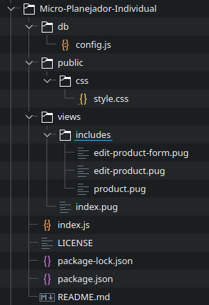

# **MPI**

Micro Planejador Individual

https://github.com/Azenha/Micro-Planejador-Individual

**Leonardo Azenha**

---

# Visão geral

* Planejamento para MEIs
* Controle de insumos
* Auxiliar futuras compras

---

# Aplicação

* Experiência pessoal
* MEIs
* Projeto pessoal

---

# Objetivos

* Uma aplicação leve e intuitiva
* Lançamento de dados e valores rapidamente

---

# Tecnologias

* Servidor Oracle Cloud
* Backend Express.JS
* Banco de dados PostgreSQL
* Frontend HMTx + Pug

---

# Solução

* CRUD objetivo

---

# Arquitetura

---

# Demonstração

[MPI](http://localhost:3000)

---

# Cronograma

* Frontend
    * Início e Login
    * Selecionar lista
* Backend
    * Implementar OAuth 2.0 (Google)
    * Incluir manipulação de listas macro
* To-Do
    * Consolidação/Relatórios

---

# Dúvidas