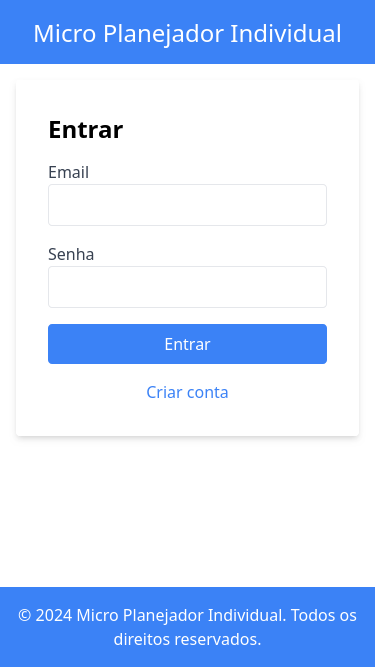
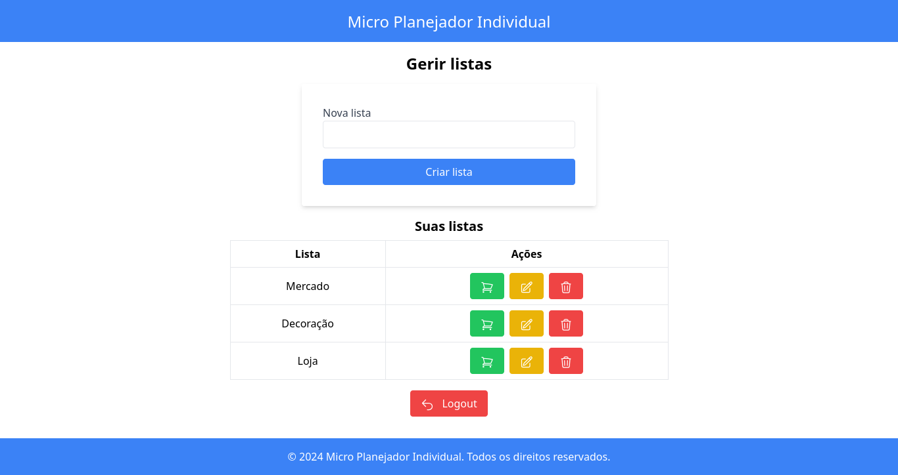
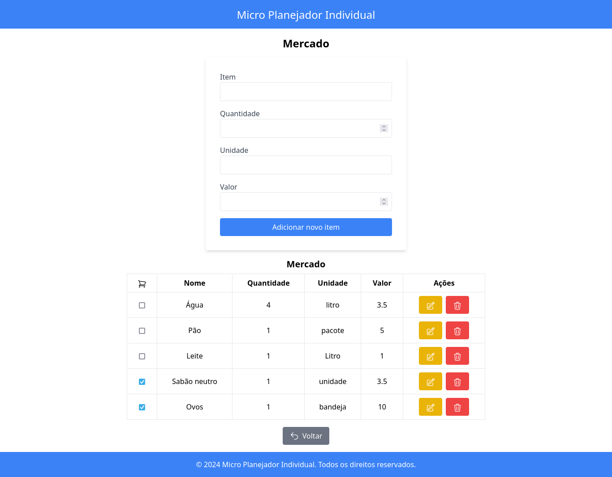

Este artigo tem como objeto ser a documentação do projeto final no Curso Superior de Tecnologia em Sistemas para Internet da [Faculdade Senac Porto Alegre - Unisenac](https://senacrs.com.br/).

## Apresentação

A ideia do projeto surgiu durante a observação do trabalho de alguns empreendedores, que utilizam as mais variadas formas ao anotar o que precisam comprar para os seus negócios, desde anotar no papel com caneta, até aplicações muito mais complexas que ocupavam um espaço considerável de sua UI com propagandas.

O projeto *Micro Planejador Individual* busca justamente o que seu nome propõe, ser uma [micro aplicação](https://micro-applications.org/) e disponibilizar para os usuários somente o essencial para gerir suas listas de compras.

## Definição

Para este *MVP* o objetivo é criar uma ferramenta de gerenciamento listas de compras, onde os seus dados estão protegidos por um sistema de login que o usuário pode acessar no navegador ou no celular.

Durante a execução do projeto me deparei com a aplicação [Hepilo](https://hepilo.com/), que embora atenda as mesmas necessidades, possui muito mais funcionalidades do que o *Micro Planejador Individual* e inspirou a adoção de um visual minimalista e livre de impedimentos visuais, como propaganda ou formulários com muitas informações.

O *Micro Planejador Individual* busca ser acessível ao usuário final em forma e função, optando por ficar no caminho do usuário durante a criação ou consultas das listas de compras.

## Objetivos

O projeto é um planejador de compras de insumos para micro empreendedores individuais (MEI), onde o foco é desenvolver uma ferramenta online, mobile-first, onde o empreendedor possa planejar suas compras com antecedência, e lançar os valores investidos por insumo e ajudar o mesmo a evitar desperdícios, além que tem como principais objetivos:

* Facilitar a Organização de Compras: Permitir aos usuários criar e gerenciar listas de compras de forma intuitiva e eficiente, melhorando a organização pessoal e familiar.
* Melhorar a Experiência do Usuário: Oferecer uma interface amigável e responsiva que simplifique o processo de adicionar, remover e gerenciar itens nas listas de compras, promovendo uma experiência positiva para os usuários.
* Aumentar a Produtividade: Auxiliar os usuários a economizar tempo durante suas compras ao proporcionar listas organizadas e de fácil acesso, otimizando o planejamento de compras regulares e ocasionais.
* Segurança e Privacidade: Garantir a segurança dos dados dos usuários, implementando práticas robustas de segurança da informação e protegendo informações sensíveis, como detalhes de login e histórico de compras.
* Escalabilidade e Flexibilidade: Desenvolver uma aplicação escalável que possa crescer conforme a demanda, suportando um número crescente de usuários e funcionalidades adicionais no futuro.
* Integração com Tecnologias Modernas: Utilizar uma stack tecnológica moderna e eficiente, incluindo frameworks como AdonisJS e Vue.js, para garantir uma base sólida e atualizada para o desenvolvimento da aplicação.
* Sustentabilidade e Manutenção: Assegurar que a aplicação seja sustentável a longo prazo, com manutenção regular, atualizações de segurança e melhorias funcionais para manter sua relevância e eficiência.

Ao alcançar esses objetivos, o projeto visa não apenas oferecer uma solução prática e eficiente para o gerenciamento de compras, mas também proporcionar uma experiência positiva e valiosa para os usuários, contribuindo para sua organização pessoal e qualidade de vida.

## Stack Tecnológico

* Infraestrutura e Servidor

    * [Oracle Cloud](https://www.oracle.com/br/cloud/free/): Utilizando como plataforma uma _VM.Standard.A1.Flex shape 4gb_ para hospedagem na nuvem da aplicação.
    * [Ubuntu Server 24.04 LTS](https://ubuntu.com/download/server): Sistema operacional escolhido pela estabilidade e suporte de longo prazo.

* Servidor Web e Proxy Reverso

    * [Caddy](https://caddyserver.com/): Servidor web e proxy reverso moderno e eficiente, conhecido pela sua simplicidade na configuração e suporte a HTTPS automático.

* Backend

    * [Node.js](https://nodejs.org/): Ambiente de execução para JavaScript server-side, escolhido pela performance e vasta disponibilidade de bibliotecas.
    * [npm](https://www.npmjs.com/): Gerenciador de pacotes padrão para Node.js, usado para instalar e gerenciar dependências do projeto.
    * [pm2](https://pm2.keymetrics.io/): Gerenciador de processos para Node.js, utilizado para monitorar e gerenciar os processos da aplicação em produção.
    * [AdonisJS](https://adonisjs.com/): Framework Node.js robusto e elegante, seguindo o padrão MVC (Model-View-Controller), utilizado para desenvolver APIs e controlar a lógica de negócios da aplicação.
    * [PostgreSQL](https://www.postgresql.org/): Sistema de gerenciamento de banco de dados relacional escolhido pela robustez, suporte ACID e escalabilidade.

* Frontend

    * [Vue.js](https://vuejs.org/): Vue.js é um framework progressivo para construir interfaces de usuário.
    * [Vite](https://vitejs.dev/): Vite é um construtor de aplicações web rápido e flexível para Vue.js, conhecido pelo seu tempo de inicialização instantâneo durante o desenvolvimento.
    * [Tailwind CSS](https://tailwindcss.com/): Framework de CSS utilitário para desenvolvimento de interfaces, permitindo estilos customizáveis de forma eficiente.
    * [Heroicons](https://heroicons.com/): Conjunto de ícones SVG otimizados para Vue.js e Tailwind CSS, facilitando a inclusão de ícones personalizados na aplicação.

Durante o desenvolvimento foi optado por uma abordagem _code-first_ este stack combina eficiência, performance e modernidade tanto no backend quanto no frontend, oferecendo uma base sólida para o desenvolvimento e escalabilidade da aplicação web.

## Arquitetura

_Diagrama ER do banco_

_Login_

_Gerenciamento de Listas_

_Gerenciamento de Itens_

## Repositórios do projeto

[Micro Planejador Individual App](https://microplan.duckdns.org)

[Micro Planejador Individual Main Repo](https://github.com/Azenha/Micro-Planejador-Individual)

[Micro Planejador Individual Backend](https://github.com/Azenha/Micro-Planejador-Individual-Backend)

[Micro Planejador Individual Frontend](https://github.com/Azenha/Micro-Planejador-Individual-Frontend)

## Desenvolvimento

Durante o projeto foi alterado stack de tecnologias para tecnologias mais atuais e com amplo suporte.

[Link do github com as alterações do projeto](https://github.com/Azenha/Micro-Planejador-Individual/commit/443fa89fa37485a48f9ece50476fe8f6236d9cd3).

## Conclusões

O projeto descrito para o desenvolvimento de uma aplicação de gerenciamento de listas de compras apresenta uma abordagem moderna e eficiente, utilizando tecnologias robustas e atuais. Com base na stack tecnológica escolhida, que inclui Oracle Cloud VM, Ubuntu Server, Caddy, Node.js com AdonisJS, Vue.js com Vite, e PostgreSQL, o projeto é estruturado para oferecer uma experiência de usuário fluida e escalável.

A decisão de adotar uma abordagem code-first para o desenvolvimento, em detrimento do tradicional db-first, permite um controle preciso sobre a lógica da aplicação e a estrutura de dados, facilitando a manutenção e a evolução contínua do sistema. Isso é especialmente relevante dada a natureza dinâmica das aplicações web modernas, onde a flexibilidade e a adaptabilidade são fundamentais.

Ao integrar tecnologias como Vue.js para o frontend e AdonisJS para o backend, o projeto visa não apenas proporcionar uma interface intuitiva e responsiva para os usuários, mas também garantir a segurança e a eficiência no processamento das operações de banco de dados. A escolha de PostgreSQL como o banco de dados principal reforça o compromisso com a robustez, a escalabilidade essenciais para aplicações que lidam com dados sensíveis e operações críticas.

Em suma, o projeto não apenas se propõe a oferecer uma solução prática para o gerenciamento de listas de compras, mas também exemplifica um paradigma moderno de desenvolvimento web, focado na qualidade, na performance e na experiência do usuário. Com uma base tecnológica sólida e uma abordagem estratégica, o projeto está bem posicionado para atender às necessidades atuais e futuras dos usuários, garantindo uma plataforma robusta e adaptável no ambiente competitivo e dinâmico da web contemporânea.

## Limitações do Projeto e Perspectivas Futuras

**Limitações do Projeto**

Apesar das vantagens e da robustez da stack tecnológica escolhida, o projeto apresenta algumas limitações que devem ser consideradas:

1. **Escopo Inicial**: O projeto pode ter um escopo inicial limitado em termos de funcionalidades oferecidas aos usuários. Isso pode impactar a adoção inicial e a satisfação do usuário se funcionalidades essenciais não estiverem presentes desde o início.
2. **Complexidade de Implementação**: A escolha de uma abordagem code-first requer um planejamento cuidadoso e uma compreensão profunda das interações entre o código e o banco de dados. Isso pode aumentar a complexidade da implementação, especialmente em equipes menos experientes.
3. **Requisitos de Manutenção**: Manter a consistência entre as atualizações de código e as alterações no esquema do banco de dados pode exigir um processo de gestão de mudanças rigoroso e eficiente.

**Perspectivas Futuras**

Apesar das limitações, o projeto possui um potencial significativo para evolução e melhoria contínua:

1. **Expansão de Funcionalidades**: Implementar novas funcionalidades, como histórico de compras, notificações de lista compartilhada, integração com sistemas de pagamento, entre outros, pode enriquecer a experiência do usuário e aumentar a utilidade da aplicação.
2. **Otimização de Desempenho**: A otimização contínua do desempenho do sistema, tanto no backend quanto no frontend, pode melhorar a velocidade de resposta e a eficiência operacional da aplicação.
3. **Expansão para Dispositivos Móveis**: Considerar o desenvolvimento de aplicativos móveis nativos ou responsivos pode expandir o alcance da aplicação e oferecer uma experiência consistente em diferentes plataformas.

Em resumo, ao enfrentar as limitações com uma abordagem estratégica e focada em melhorias contínuas, o projeto tem o potencial de se tornar uma solução robusta e valorizada no mercado de gerenciamento de listas de compras, proporcionando benefícios tangíveis tanto para os usuários quanto para os desenvolvedores.